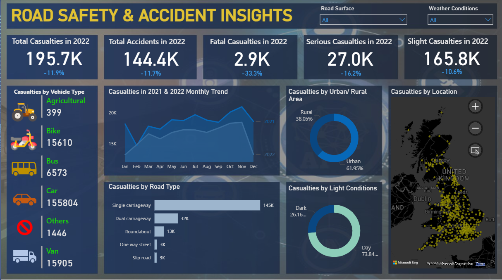

# 🚦 Road Safety & Accident Insights Dashboard | Power BI

## 📌 Overview

This project showcases an interactive **Road Safety & Accident Insights Dashboard** built using **Power BI**. The dashboard transforms raw road accident data into meaningful insights, helping analyze accident trends, casualty distribution, vehicle categories, road types, weather conditions, and location-based accident patterns.

It enables users to explore the data through interactive visuals, filters, and KPIs for better decision-making.

---

## 📷 Dashboard Preview

---

## 🎯 Project Objectives

- 📊 Analyze total accidents and casualties.
- 📈 Compare accident trends across months.
- 🚗 Identify casualties by vehicle type.
- 🛣️ Analyze accidents by road type.
- 🌆 Compare Urban vs Rural accident distribution.
- 🌙 Evaluate accidents based on light conditions.
- 🗺️ Visualize accident hotspots using map visuals.
- 🎛️ Provide interactive filtering with slicers.

---

## 💡 Key Insights

- 🚑 Total Casualties: **195.7K**
- 🚘 Total Accidents: **144.4K**
- ❌ Fatal Casualties: **2.9K**
- ⚠️ Serious Casualties: **27K**
- ✅ Slight Casualties: **165.8K**
- 🌆 Urban areas recorded more casualties than rural areas.
- 🛣️ Single carriageways had the highest number of casualties.
- ☀️ Most accidents occurred during daylight.

---

## 📊 Dashboard Features

- ✅ KPI Cards
- 📈 Monthly Trend Analysis
- 🚗 Vehicle Type Analysis
- 🛣️ Road Type Analysis
- 🌆 Urban vs Rural Comparison
- 🌙 Light Condition Analysis
- 🗺️ Interactive Map
- 🎛️ Dynamic Slicers & Filters

---

## 🛠️ Tools & Technologies

- 📊 Power BI
- ⚡ Power Query
- 📐 DAX
- 📑 Microsoft Excel

---

## 📂 Dataset

The dataset contains information related to:

- Accident Date
- Accident Severity
- Vehicle Type
- Road Type
- Casualties
- Urban/Rural Area
- Light Conditions
- Weather Conditions
- Road Surface
- Latitude & Longitude

---

## 📈 Skills Demonstrated

- 📊 Data Visualization
- 📈 Dashboard Design
- 📐 DAX Measures
- ⚡ Data Cleaning
- 🔄 Data Transformation
- 📌 KPI Reporting
- 🗺️ Interactive Reporting

---

## 🚀 How to Use

1. Download the `.pbix` file.
2. Open it in **Power BI Desktop**.
3. Refresh the dataset if required.
4. Use the slicers to explore different accident insights.

---

## 👨‍💻 Author

**Aakash Nath**

📧 Email: nathaakash855@gmail.com

💼 LinkedIn: https://linkedin.com/in/aakashnath2003 

---

## ⭐ If you found this project useful, don't forget to Star the repository!
